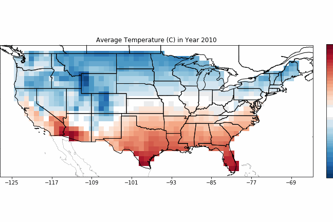

# Subseasonal Data Python Package

The `subseasonal_data` package provides an API for loading and manipulating the **SubseasonalClimateUSA** dataset developed for training and benchmarking subseasonal forecasting models.  Here, _subseasonal_ refers to climate and weather forecasts made 2-6 weeks in advance.  See [DATA.md](DATA.md) for a description of dataset contents, sources, and processing.

## Getting Started

- Install the subseasonal data package: `pip install subseasonal-data`
- Define the environment variable `$SUBSEASONALDATA_PATH` to point to your desired data directory; any accessed data files will be read from, saved to, or synced with this directory

 This package is compatible with Python version 3.6+. 
 
 The underlying data is made available through Azure and is updated periodically. To download the data through this package, you will need to have the Azure Storage CLI [`azcopy`](https://docs.microsoft.com/en-us/azure/storage/common/storage-use-azcopy) installed on your machine.

## Usage Examples

Detailed usage examples are provided in the `Getting Started` and `Examples` notebooks in the `examples` folder. It is recommended you start there.

Quick examples:

* Download all data

**WARNING:** This requires an estimated 175GB disk space.

```Python
from subseasonal_data import downloader

downloader.download()
```

* List files in a data directory

```Python
downloader.list_subdir_files(data_subdir="combined_dataframes")
```

* Download one data file

```Python
downloader.download_file(
    data_subdir="combined_dataframes", 
    filename="all_data-us_precip_34w.feather", 
    verbose=True)
```

* Load ground truth data

```Python
from subseasonal_data import data_loaders

# Loads into a Pandas dataframe
df = data_loaders.get_ground_truth("us_precip")
```

* Load combined dataframes

```Python
data_loaders.load_combined_data("all_data", "us_tmp2m", "34w")
```

See the `Usage Examples.ipynb` notebook for an example on how to retrieve historical temperature data using the `subseasonal_data` package. 



## For Developers

### Installation

Install from source in editable mode using `pip install -e .` in this directory or `pip install -e path/to/directory` from another directory. 

### Running tests 

To test your installation, run `python -m unittest [test_name].py` from the `subseasonal_data/tests` directory or `python -m unittest path/to/tests/folder/[test_name].py`. Example:

```Python
python -m unittest subseasonal_data/tests/test_data_loaders.py
```

### Generating Documentation

This project's documentation is generated via [Sphinx](https://www.sphinx-doc.org/en/master/index.html). The HTML theme used is the [Read the Docs](https://github.com/readthedocs/sphinx_rtd_theme) shpinx theme which also needs to be installed.

To generate a local copy of the documentation from a clone of this repository, run `python setup.py build_sphinx -W -E -a`, which will build the documentation and place it under the `build/sphinx/html` path. 

The reStructuredText files that make up the documentation are stored in the [docs directory](https://github.com/paulo-o/forecast_rodeo_ii/tree/master/data_package/doc); module documentation is automatically generated by the Sphinx build process.

## Data Usage and Citation

If you make use of the `subseasonal_data` package or the **SubseasonalClimateUSA** dataset, please acknowledge the Python package, the individual data sources described in [DATA.md](./DATA.md), and the associated **SubseasonalClimateUSA** preprint:

[Learned Benchmarks for Subseasonal Forecasting](https://arxiv.org/pdf/2109.10399.pdf)  
Soukayna Mouatadid, Paulo Orenstein, Genevieve Flaspohler, Miruna Oprescu, Judah Cohen, Franklyn Wang, Sean Knight, Maria Geogdzhayeva, Sam Levang, Ernest Fraenkel, and Lester Mackey.  Sep. 2021.

```
@article{
  mouatadid2021toolkit,
  title={Learned Benchmarks for Subseasonal Forecasting},
  author={Soukayna Mouatadid, Paulo Orenstein, Genevieve Flaspohler, Miruna Oprescu, Judah Cohen, Franklyn Wang, Sean Knight, Maria Geogdzhayeva, Sam Levang, Ernest Fraenkel, and Lester Mackey},
  journal={arXiv preprint arXiv:2109.10399},
  year={2021}
}
```

## Contributing

This project welcomes contributions and suggestions.  Most contributions require you to agree to a
Contributor License Agreement (CLA) declaring that you have the right to, and actually do, grant us
the rights to use your contribution. For details, visit https://cla.opensource.microsoft.com.

When you submit a pull request, a CLA bot will automatically determine whether you need to provide
a CLA and decorate the PR appropriately (e.g., status check, comment). Simply follow the instructions
provided by the bot. You will only need to do this once across all repos using our CLA.

This project has adopted the [Microsoft Open Source Code of Conduct](https://opensource.microsoft.com/codeofconduct/).
For more information see the [Code of Conduct FAQ](https://opensource.microsoft.com/codeofconduct/faq/) or
contact [opencode@microsoft.com](mailto:opencode@microsoft.com) with any additional questions or comments.

## Trademarks

This project may contain trademarks or logos for projects, products, or services. Authorized use of Microsoft 
trademarks or logos is subject to and must follow 
[Microsoft's Trademark & Brand Guidelines](https://www.microsoft.com/en-us/legal/intellectualproperty/trademarks/usage/general).
Use of Microsoft trademarks or logos in modified versions of this project must not cause confusion or imply Microsoft sponsorship.
Any use of third-party trademarks or logos are subject to those third-party's policies.
